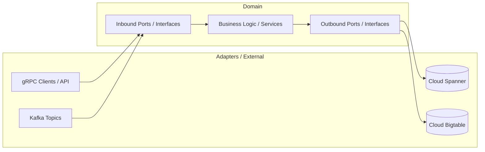

# Google style Hexagonal microservices

This distributed system is built on a Hexagonal microservices architecture, designed to provide scalable monitoring, logging, and reporting capabilities. 

TechStack: Java 21, Kafka, gRPC (Protobuf), Snipper, BigTable, etc.

## ☕ About 

Designed and developed a multi-microservice system from scratch.
Implemented the core architecture based on Hexagonal architecture principles.

## 🧩 Architecture Overview
The application is composed of several microservices that communicate with each other over Kafka and gRPC (Protobuf).

### Consist of next microservices:

<a href="https://github.com/makklays/java-gateway-service-hexagonal" target="_blank" >API Gateway microservice (Hexagonal)</a> 

<a href="https://github.com/makklays/java-report-service-hexagonal" target="_blank" >Report microservice (Hexagonal)</a> 

<a href="https://github.com/makklays/java-log-service-hexagonal" target="_blank" >Log microservice (Hexagonal)</a> 

## 🎯 Project Goals

The primary goal of this project is to demonstrate the integration of Google Cloud technologies within a modern, highly scalable distributed system. 

Built from scratch using a Hexagonal microservices architecture, it serves as a showcase for high-throughput processing, logging, and monitoring. 

The system highlights the practical application of Google’s managed infrastructure, specifically leveraging Cloud Spanner and Bigtable, combined with Kafka and gRPC (Protobuf).

## 🏗️ Architecture Overview

The system is designed around **Hexagonal Architecture (Ports and Adapters)** principles to decouple the core business logic from external infrastructure, frameworks, and Google Cloud services.

### Core Components:
* **Domain / Business Logic:** The pure core containing business rules, independent of any databases or messaging systems.
* **Inbound Ports & Adapters:** Inbound ports define how to interact with the core. gRPC services and Kafka consumers act as inbound adapters, driving the application.
* **Outbound Ports & Adapters:** Outbound ports define interfaces for external capabilities. Infrastructure adapters implement these interfaces to persist data into Google Cloud Spanner and Bigtable, or publish events to Kafka.
