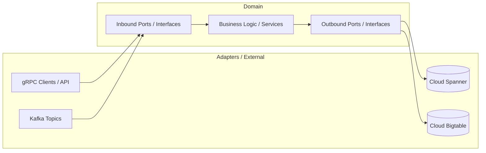

# 🧠 Google style Hexagonal microservices

This distributed system is built on a Hexagonal microservices architecture, designed to provide scalable monitoring, logging, and reporting capabilities. 

TechStack: Java 21, Kafka, gRPC (Protobuf), Spanner, BigTable, etc.

## ☕ About 

Designed and developed a multi-microservice system from scratch.
Implemented the core architecture based on Hexagonal architecture principles.

## 🧩 Architecture Overview
The application is composed of several microservices that communicate with each other over Kafka and gRPC (Protobuf).

### Consist of next microservices:

<a href="https://github.com/makklays/java-gateway-service-hexagonal" target="_blank" >API Gateway microservice (Hexagonal)</a> 

<a href="https://github.com/makklays/java-report-service-hexagonal" target="_blank" >Report microservice (Hexagonal)</a> 

<a href="https://github.com/makklays/java-log-service-hexagonal" target="_blank" >Log microservice (Hexagonal)</a> 

## 🎯 Project Goals

The primary goal of this project is to demonstrate the integration of Google Cloud technologies within a modern, highly scalable distributed system. 

Built from scratch using a Hexagonal microservices architecture, it serves as a showcase for high-throughput processing, logging, and monitoring. 

The system highlights the practical application of Google’s managed infrastructure, specifically leveraging Cloud Spanner and Bigtable, combined with Kafka and gRPC (Protobuf).

## 🏗️ Architecture Overview

The system is designed around **Hexagonal Architecture (Ports and Adapters)** principles to decouple the core business logic from external infrastructure, frameworks, and Google Cloud services.



### Core Components:
* **Domain / Business Logic:** The pure core containing business rules, independent of any databases or messaging systems.
* **Inbound Ports & Adapters:** Inbound ports define how to interact with the core. gRPC services and Kafka consumers act as inbound adapters, driving the application.
* **Outbound Ports & Adapters:** Outbound ports define interfaces for external capabilities. Infrastructure adapters implement these interfaces to persist data into Google Cloud Spanner and Bigtable, or publish events to Kafka.

## 🚀 How to Run

The entire infrastructure—including Google Cloud emulators, Apache Kafka, and the microservices—is fully containerized and orchestrated via Docker Compose for easy local development.

### 📋 Prerequisites

Before running the system, ensure you have the following installed:
* [Docker Desktop](https://docker.com) (with Docker Compose)
* [grpcurl](https://github.com) or [Postman](https://postman.com) (to test gRPC endpoints)

### 🛠️ Quick Start

1. **Clone the repository:**
   ```bash
   git clone https://github.com
   cd your-repo-name
   ```

2. **Build the microservices:**
   Compile the Java 21 applications and generate Protobuf classes:
   ```bash
   ./mvnw clean package -DskipTests
   # or if you use Gradle: ./gradlew build -x test
   ```

3. **Spin up the environment:**
   Start all databases (Cloud Spanner/Bigtable emulators), Kafka, and the microservices in detached mode:
   ```bash
   docker-compose up --build -d
   ```

4. **Verify the containers are running:**
   ```bash
   docker ps
   ```
### 🔍 Verification & Testing

* **gRPC API:** The microservices expose gRPC endpoints. You can interact with them via `grpcurl`:
  ```bash
  grpcurl -plaintext localhost:50051 list
  ```
* **Kafka Topics:** Messages are automatically routed between services. You can monitor Kafka logs using:
  ```bash
  docker-compose logs -f kafka
  ```
* **Google Emulators:** Cloud Spanner and Bigtable run locally inside official Google Cloud emulator images, meaning no active GCP billing is required for testing.

### 🛑 Stopping the System

To stop and remove all containers, networks, and volumes:
```bash
docker-compose down -v
```

